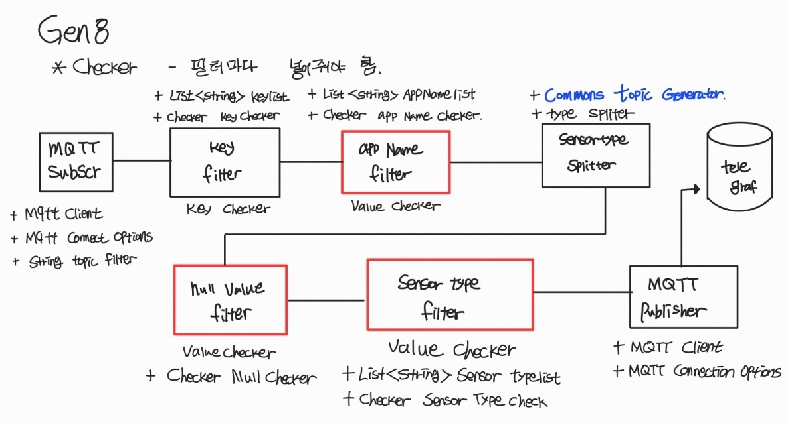

# Mini-TeamProject-IOT_Gateway
 
 
 
 

미니프로젝트 시작을 앞서 Node 구성은 아래와 같이 작성하였다.
# MQTT 노드 (수정요)
</img>

 
 
 
 

# 클래스 구조 & 내용
## Checker
1. **Checker 클래스:**
    - **설명:** 메세지 체크에 대한 계약을 정의하는 인터페이스이며 여러 Checker를 구현하여 메세지 유효성을 검증할 수 있다.
    - **필요성:** 메세지 일관성을 보장하고 잘못된 데이터가 시스템으로 유입되는 것을 방지한다.
2. **KeyChecker 클래스:**
    - **설명:** Json 메시지에서 특정 키 존재 여부를 확인하는 클래스이다.
    - **필요성:** 특정 필수 키의 유무 검사하여 필요한 데이터가 존재하는지 확인한다.
3. **NullValueChecker 클래스:**
    - **설명:** 특정 키와 연결된 값이 null이 아닌지 확인하는 클래스이다.
    - **필요성:** Null 값이 예상되지 않는 상황에 무효한 데이터를 필터링한다.
4. **SubValueChecker 클래스:**
    - **설명:** 중첩된 Json 객체에서 확인 수행하는 클래스로 'ValueChecker 클래스'를 확장한다.
    - **필요성:** 중첩된 데이터에서 특정 값(Key)의 유무를 검증한다.
5. **ValueChecker 클래스:**
    - **설명:** 특정 키와 연결된 값이 주어진 리스트에 포함된 값 중 하나를 포함하는지 확인한다.
    - **필요성:** 특정 값을 포함하는 데이터를 식별하여 필터링한다. 

## Messeage
1. **Message 클래스:**
    - **설명:** Payload 데이터를 캡슐화하는 제네릭 클래스이다.
    - **필요성:** 메세지 payload의 일관된 형식을 유지하고 캡슐화함으로서 시스템 간의 통신을 단순화한다.

## Node
1. **Filter 클래스:**
   - **설명:** 'Checker' 조건을 기반으로 메세지를 필터링하는 노드 클래스이다.
   - **필요성:** MQTT 메시지를 필터링하여 원하는 조건을 충족하는 경우에만 메시지를 전송할 수 있도록 한다.

2. **InputNode 클래스:**
    - **설명:** 입력 포트가 있는 노드를 나타내는 추상클래스이다.
    - **필요성:** 다른 노드에서 메세지를 수신하는데 사용되는 입력 포트를 정의한다.

3. **InputOutputNode 클래스:**
    - **설명:** 입력 및 출력 포트가 있는 노드를 나타내는 추상클래스이다.
    - **필요성:** 입력 및 출력 포트를 모두 가지고 있어 다른 노드와의 효율적으로 통신한다.

4. **MqttPublisher 클래스:**
   - **설명:** MQTT 클라이언트를 통해 메시지를 브로커에 발행하는 클래스이다.
   - **필요성:** 시스템에서 생성된 메시지를 MQTT 브로커로 발행하여 외부 시스템에서 해당 메시지를 구독할 수 있도록 한다.

5. **MqttSubscriber 클래스:**
   - **설명:** MQTT 브로커로부터 메시지를 구독하고, 받은 메시지를 OutputNode로 전송하는 클래스이다.
   - **필요성:** 외부 MQTT 브로커로부터 메시지를 구독하여 시스템에 통합할 수 있도록 한다.

6. **Node 클래스:**
   - **설명:** 일반적인 처리 노드를 나타내는 추상클래스이다.
   - **필요성:** 모든 노드가 공통으로 가져야 하는 기능 및 속성을 정의한다.

7. **ObjectGenerator 클래스:**
    - **설명:** 수신된 데이터에서 새로운 메세지를 생성하는 노드 클래스이다.
    - **필요성:** 기존 데이터에서 파생된 메세지를 생성하여 시스템에 유연성을 제공한다.

8. **OutputNode 클래스:**
    - **설명:** 출력 포트가 있는 노드를 나타내는 추상클래스이다.
    - **필요성:** 다른 노드에 메세지를 전송하는데 사용되는 출력 포트를 정의한다.

## Port
1. **Port 클래스:**
    - **설명:** 메세지 전달 포트를 나타내는 클래스이다.
    - **필요성:** 노드 간의 통신을 위해 메세지를 송수신 할 수 있는 인터페이스를 제공한다.

## 기타
1. **CommonsTopicGenerator 클래스:**
    - **설명:** JSON 구조를 기반으로 MQTT 주제를 생성하는 클래스이다.
    - **필요성:** 특정 데이터 구조에서 MQTT 주제를 생성하여 Topic을 효과적으로 관리한다.

2. **Mqtt 클래스:**
    - **설명:** MQTT 시스템을 제어하는 메인 클래스이다.
    - **필요성:** 시스템 전반을 제어하고 다양한 노드 간의 상호 작용을 조율한다.

3. **TypeSplitter 클래스:**
    - **설명:** JSON 객체를 Key-Value 쌍으로 분리하는 클래스이다.
    - **필요성:** JSON 데이터를 세분화하여 노드가 필요로 하는 형식을 변환한다.

 
 
 
 

# 프로젝트 구성 변화도
아래는 프로젝트를 시작하면서 초기 설계를 기반으로 여러 부분에서 수정 및 발전이 이루어졌다. 
아래는 이 프로젝트의 주요 설계 변경 내용이다.
 

## Generation 3
</img>

Generation 3는 포트를 노드시점에 사용하다보니 InPut, Output 노드가 바뀌었다.

노드를 이렇게 지정한 이유는 메시지가 노드시점에서 Messeage가 나가는 방식 때문에 이러한 방식을 사용하였다.

- MQTT In은 Output 기준이며 MQTT Out은 Input으로 가정한다.
- JSONObject를 생성하여 000[설명 채워주세요.] 한다.
- SensorType Splitter를 사용하여 Type에 따라 Message를 생성한다.
- Null Value Filter에서는 NullCheck를 ooo[설명 채워주세요.] 한다.

 
 

## Generation 4
</img>

Generation 4에서는 3와 달리 구조가 변경이 된다. 

노두 수정된 부분 타입에 따라 메세지 생성 설명 

### 구조변경 부분
- DeviceInfo Key Filter -> Key Filter

- Make Sensor Info -> Sensor Type Filter

### 구조 변경 설명

DeviceInfo Key Filter가 Key Filter로 바뀜으로 Device Key가 아닌 것도 값도 있으니 크게 확장하는 개념으로 변경을 하였다.

Make Sensor Info -> Sensor Type Filter 바뀜으로 

### 필드구성
MQTT Subscriber에서는 필드가 3개가 추가된다.
1. MQTT Client
2. MQTT Connect Options
3. String Topic Filter

set Option() -> main() 

여기서 set Option()는 main()으로 작성한다.

### 특징
여기서 각 클래스의 Filter는 Checker에서 체크 후 필요한 부분만 가져온다. 

또한 Sensor Type은 설정 타입으로 설정을 해준다.

 
 

## Generation 8
</img>

### 특징

### Value Checker
 - AppName Filter
 - NullValue Filter
 - SenesorType Filter

 위 이미지 빨간색 상자 3개는 클래스 공통의 값이라 판단하였고, 아래 이미지를 보면 같이 공통으로 값이 들어오게 클래스를 작성하였다. 

 이미지 마지막 코드(value) 부분에서는 위 3가지 클래스에 많은 데이터를 받아온다.

### Value Checker.java
.png)

 
 

## Generation 9
</img>

### 구조 변경
 Sensor Type Spliter -> Object Generator

### 구조 설명
Commons Topic Generator를 클래스로 두고 Type Spliter를 가지고 둘 다 포용하기 위해 Sensor Type Spliter를 클래스로 만들었다.

### 특징
각 Filter에서 체크는 각각 다르다.

Key Filter는 Key Checker이며, AppName Filter와 Null Value Filter, Sensor Type Filter는 각각 Value Filter에서 각각 체크하여 값을 뽑아낸다. 